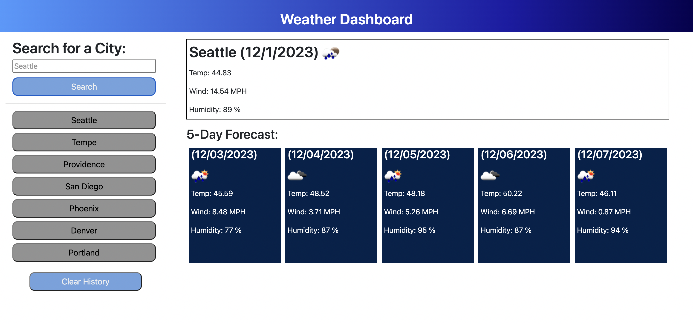

# Weather-Dashboard
Displays the 5 day weather forecast for the location of your choice. 

## Description

Welcome to my Weather Dashboard app. Use the search bar to search for a city and see its current weather data. It will also display the 5 day forecast of the location. 

This application is built primarily with JavaScipt. It was an exercise in pulling data from the openWeather API and dynamicly creating elements using JavaScript. 

Enjoy!

## Screenshots

## [Click here to view my project!](https://jessebradbury.github.io/Weather-Dashboard/)
